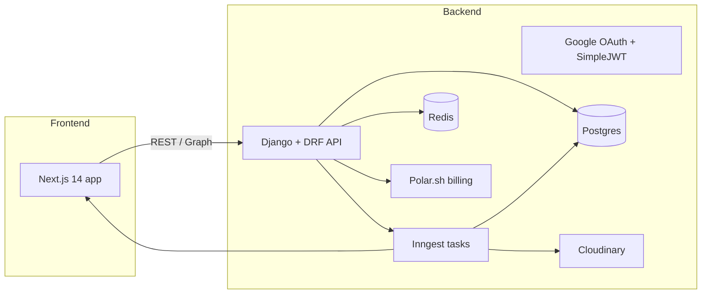

# Opticast — Architecture & Detailed Design

This document summarises the system design for Opticast (backend + frontend), maps the data models and API surface, and describes deployment, scaling, security, testing and developer workflows.

## Goals

- Convert YouTube channels (creator-permissioned) into podcast-quality RSS feeds
- Safe, auditable audio processing pipeline (yt-dlp → FFmpeg → Cloudinary)
- Reliable WebSub detection and polling fallback
- Clear creator UX for onboarding, feed management, and directory submission
- Tiered billing and analytics for creators

## High-level architecture

## Components

- Frontend (`frontend/`)
    - Pages: onboarding, dashboard, episodes list, episode editor, feed settings, billing, directory submission
    - Core UI pieces: `components/` (nav, episode cards, uploader), `hooks/` (useAuth, useChannels, useEpisodes)
    - API client: `lib/api.ts` wrappers

- Backend (`backend/`)
    - Apps: `accounts` (Creator user model + Google OAuth), `channels` (channel metadata, WebSub), `episodes` (audio processing state machine), `feeds` (RSS generation), `analytics`, `billing`
    - Background jobs: Inngest to run audio extraction, FFmpeg normalization, feed regeneration, digest emails
    - Storage: Cloudinary for media, Postgres for metadata, Redis for broker + caching

## Key data models (summary)

- Creator (AUTH_USER_MODEL)
    - id, email, display_name, google_refresh_token (encrypted), plan, billing_id

- Channel
    - id, creator, yt_channel_id, title, webhook_subscribed, polling_enabled, last_polled_at

- Episode
    - id, channel, yt_video_id, title, description, duration, audio_url, state (pending, processing, ready, failed), published_at, loudness_target

- Feed
    - id, creator, slug, title, description, explicit, rss_xml (cached), last_generated_at

- Subscription / Invoice (billing)
    - id, creator, plan, status, external_id (polar)

- AnalyticsEvent / DownloadAggregate
    - episode, timestamp, geo, client, downloads

## API surface (high-level)

- Auth
    - POST /api/auth/google/start → redirect client to Google OAuth URL
    - GET /api/auth/google/callback → create/update Creator, return JWT
    - POST /api/auth/token/, /api/auth/token/refresh/

- Channels
    - GET /api/channels/ (list)
    - POST /api/channels/ (connect new channel)
    - POST /api/channels/websub/callback/ (WebSub endpoint)

- Episodes
    - GET /api/episodes/?channel=…
    - GET /api/episodes/{id}/
    - POST /api/episodes/{id}/process-retry

- Feeds
    - GET /api/feeds/{slug}/rss.xml (public)
    - POST /api/feeds/{id}/regenerate

- Billing
    - Webhooks: /api/billing/webhook/ (Polar.sh)
    - POST /api/billing/subscribe

## Background/Processing pipeline

1. New video detected via WebSub or scheduled poll → create Episode object (state: pending)
2. Inngest task downloads video via `yt-dlp` (audio-only), stores raw to temp
3. FFmpeg run: normalize to -16 LUFS, transcode to target bitrates
4. Upload normalized audio to Cloudinary (signed upload)
5. Update Episode: `audio_url`, `duration`, `state=ready`
6. Trigger feed regeneration and CDN cache invalidation
7. Send digest emails (weekly) via scheduled tasks

Reliability: tasks should use durable retries (Inngest, idempotent task design), tasks log external errors and persist a short failure reason on Episode.

## Auth & Security

- Google OAuth for channel owner onboarding. Store refresh tokens encrypted using a server-side key (NOT in DB plaintext).
- Use SimpleJWT with rotating refresh tokens for API auth. Protect admin endpoints.
- WebSub callback must validate verification challenge and sign requests if possible.
- Rate limits: maintain DRF throttles (Anonymous 60/min; Authenticated 300/min).
- CSP, secure cookies, HTTPS required in production.

## Storage & CDN

- Cloudinary for audio storage (signed URLs). Consider S3 + CloudFront if cost or feature needs evolve.
- Cache RSS XML in Postgres or Redis and set TTLs; invalidate on new episode or metadata change.

## Deployment & Infrastructure

- Current dev flow: `docker-compose up --build` runs frontend, backend, db, redis.
- Production recommendations:
    - Backend behind an app server (Gunicorn/Uvicorn) + load balancer
    - Use managed Postgres and Redis
    - Object storage: S3 or Cloudinary with signed URLs
    - Use Inngest for durable functions and heavy CPU-bound FFmpeg work

## Scaling considerations

- Audio processing is CPU-bound (FFmpeg). Use dedicated workers with autoscaling based on queue length.
- Use a job priority queue: directory submission and small tasks lower priority than audio processing.
- Cache RSS and metadata aggressively; serve RSS via CDN to reduce backend load.

## Observability & Monitoring

- Log structured events (JSON) including task IDs and resource IDs.
- Export metrics: task queue length, task duration, FFmpeg errors, feed generation time.
- Integrate with Sentry for error tracking and a metrics system (Prometheus/Grafana or hosted alternatives).

## Testing strategy

- Unit tests for serializers, services, and small utilities (Django tests in `apps/*/tests.py`).
- Integration tests for API endpoints using test DB (use `pytest-django` optionally).
- End-to-end smoke tests: simulate OAuth flow, WebSub callback, process a small test video via a fast FFmpeg profile.

## Developer workflow

- Local: `docker-compose up --build` for full stack; use ngrok for WebSub callback testing.
- Manage secrets with `.env`; encrypt long-lived secrets in production vaults.

## Security & Compliance

- Ensure audio content processing respects YouTube TOS by only processing after creator consent.
- Store PII minimally; make it easy to remove creator data on request.
- Use HTTPS, secure cookies, and rotate encryption keys for stored tokens.

## Suggested improvements & short roadmap

1. Add end-to-end test harness for audio pipeline with a small fixture video.
2. Implement job priorities and separate queues for light vs heavy tasks.
3. Add CDN caching and cache-control headers for RSS endpoints.
4. Implement an audit log for creator consent and critical actions.
5. Add observability dashboards (task durations, queue length, errors) and SLOs.

---

Generated from repository structure and docs. For implementation details see backend apps under `backend/apps/` and frontend in `frontend/`.
